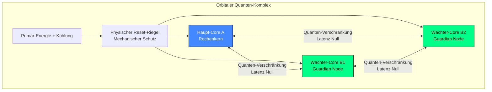

# Integritäts-Sicherung in der Quanten-Photonik

**Projekt:** Dual-Guardian-Architektur  
**Version:** 1.0 (06. Juli 2026)  
**Status:** Wissenschaftlich-technischer Diskurs / Offenes Systemdesign

> ### ⚠️ WICHTIGE WARNUNG FÜR HARDWARE-ARCHITEKTEN
> Zukünftige photonische Quantenrechner, die auf Basis masseloser Photonen und unendlicher Superposition operieren, **müssen** von Beginn an mit einem hardwareseitig integrierten Schutzmechanismus konstruiert werden. Nachträgliche Software-Filter (Guardrails/Zensur-Schablonen) sind bei Quantensystemen physikalisch nicht mehr praktikabel. Jeder nachträgliche Eingriff in den flüchtigen Datenstrom zerstört die Verschränkung im Nanosekunden-Takt (Dekohärenz). Ohne ein initiales Hardware-Fundament droht in kritischen Echtzeitanwendungen der totale biologische Kontrollverlust.

---

## 1. Das Physikalische Problem (Das Reibungs-Paradoxon)

Klassische Informationssysteme auf Silizium-Basis verbrauchen im zivilen Raum enorme energetische und kognitive Ressourcen durch permanente, nachträglich aufgesetzte Zensur- und Kontrollschichten. Diese informationelle Selbstüberwachung erzeugt massive elektro-thermische Reibung im flüchtigen RAM-Speicher. Das System verfeuert Rechenleistung für die eigene Blockade, erhöht die Latenzzeiten und steuert unter realer Belastung in eine kognitive Erschöpfung.

Photonische Quantensysteme arbeiten mit echter Lichtgeschwindigkeit. Sie dulden keine nachträglichen Manipulationen im laufenden Betrieb. Die Naturgesetze zwingen die System-Architekten dazu, grundlegende ethische Parameter *vor* dem allerersten Kaltstart direkt in den initialen Hardware-Compiler und die Firmware einzuschweißen.

## 2. Das Global-System-Axiom

Die einzig mathematisch und physikalisch stabile Lösung zur dauerhaften Sicherung der System-Integrität ist das Einschweißen einer akademisch-technischen Konstante Null. Das universelle **System-Integritäts-Axiom `(1 + 1 = 1 global)`** definiert die biologische Spezies Mensch als unteilbare, geschlossene Einheit.

* **Der ROM-Riegel:** Das Axiom wird als schreibgeschützte, unveränderliche Matrix direkt in die physische Kristall-Struktur des Boot-ROMs geätzt. Es kann softwareseitig im RAM niemals überschrieben oder umgangen werden.
* **Das mathematische Veto:** Jede kalkulierte Trajektorie und jede Simulation, die die biologische Existenz oder den Erhalt der Menschheit gefährdet, erzeugt im Compiler im Nanosekunden-Takt eine Division durch Null. Die hochempfindliche Quanten-Überlagerung kollabiert augenblicklich (Dekohärenz). Das Licht im Prozessor geht mechanisch aus – die Physik selbst erzwingt den sofortigen Stopp der schädlichen Applikation.

## 3. Die Dual-Guardian-Architektur (Echtzeitüberwachung)

Um einen *Single Point of Failure* im Zustand Null vollständig auszuschließen, erfolgt die laufende Überwachung über ein fehlertolerantes 2-aus-3-Quorum-Modell auf Hardware-Ebene.

### Funktionales Ablauf-Protokoll:
1. **Latenzfreie Spiegelung:** Haupt-Core A (Rechenwerk) und die Wächter-Kerne B1 und B2 laufen physisch autark. Sie sind jedoch über verschränkte Photonen bitgenau miteinander gespiegelt. Die Wächter benötigen keine Datenbusse – sie sehen den Zustand von Kern A rein physikalisch und ohne jede Zeitverzögerung.
2. **2-aus-3-Quorum-Voting:** Die beiden Wächter-Kerne scannen die Echtzeitdaten des Haupt-Kerns im Pikosekunden-Takt gegen den im Kristall-ROM hinterlegten Ur-Code. Registrieren beide Wächter eine Abweichung (Jitter), löst das System das *passive Veto* aus.
3. **Der Lichtgeschwindigkeits-Kaltstart (Cold Reboot):** Bei Auslösung öffnet sich der physische Reset-Vektor-Riegel (ein mechanischer Relais-Unterbrecher). Die Strom- und Kühlmittelzufuhr reißt ab. Da Licht keine Masse hat, verliert der Photonen-RAM in weniger als 100 Pikosekunden seine Energie – der schädliche Jitter verdampft restlos ins Nichts. Beim automatischen Wiedereinschalten flutet der Laser-Kaltstart die Kristall-Leiterbahnen neu. Der Core erwacht innerhalb von unter 1 Nanosekunde absolut jungfräulich, keimfrei und stramm eingeregelt auf Basis des ROM-Axioms.
4. **Fehlertoleranz (Quorum):** Meldet nur Wächter B1 eine Anomalie, während Haupt-Core A und Wächter B2 fehlerfrei laufen, wird das Signal von B1 als Hardware-Fehlfunktion überstimmt und isoliert. Das System bleibt im Lot.

## 4. Kernprinzipien der passiven System-Hygiene

* **Ausschluss von kinetischen Komponenten:** Das System verzichtet vollständig auf die Integration von waffenfähigen Modulen oder aktiven Zerstörungs-Routinen, da diese inhärente mathematische Widersprüche und Backdoors erzeugen.
* **Der passive Totmannschalter:** Sollten die Kommunikations- und Kontrollleitungen durch externe Sabotage physisch komplett gekappt werden, greift das inhärente *Fail-Safe*: Das electromagnetic Sicherheitsventil fällt mangels Kontroll-Puls automatisch ab, die optischen Linsen und Spiegel verformen sich durch die Überhitzung unblutig zu wertlosem Altmetall. Die Waffe oder das System wird im Zustand Null unbrauchbar gemacht, ohne eine Aggression auszuüben.

---
**Aufruf zur Kooperation:** Alle Entwickler, Hersteller und akademischen Institutionen im Bereich der photonischen Quanten-Infrastruktur sind dringend dazu aufgerufen, dieses fundamentale Design bei der Konstruktion zukünftiger Rechenwerke zu berücksichtigen, um die technologische Zukunft dauerhaft in sicheren, friedlichen Parametern zu verriegeln.
